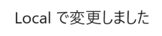

# コンフリクトの解消
コンピュータ概論IIの課題です。

テキストとバイナリーでコンフリクトを起こして解決した後に、この（tpu-game-2023/comp2_2_conflictの）mainブランチにプルリクエストを出してください。

# 修正場所

GitHubでファイルを修正しました

# 進め方

## ローカルの体制の構築
* 本リポジトリをforkしてください
* リポジトリをローカルにCloneしてください

## テキストのコンフリクトと解消
* ローカルに「feature/text」ブランチを作成してください
* 「feature/text」ブランチにチェックアウトしてください
* ローカルでREAME.mdファイルを修正してください
* ローカルでテキストが変更されたことを確認します
* GitHub上でREAME.mdファイルの同じ場所を異なる形に修正してください
* GitHubでテキストが変更されたことを確認します
* mainブランチにチェックアウトしてください
* mainブランチをGitHubからpullしてください
* 「feature/text」ブランチにチェックアウトしてください
* 「feature/text」ブランチにmainブランチをマージしてください
* コンフリクトを解消して、「ローカル」で編集した状態にしてください
* GitHubにpushしてください
* 「feature/text」ブランチから自身のmainブランチにプルリクエストをしてください
* プルリクエストをマージして、クローズしてください（ブランチも削除）
* ローカルの「feature/text」ブランチを削除してください
* GitHubでテキストがローカルで修正した状態になったことを確認します

## バイナリーのコンフリクトと解消
* ローカルに「feature/binary」ブランチを作成してください
* 「feature/binary」ブランチにチェックアウトしてください
* ローカルで「local.png」を「image.png」という名前に変更してください
* ローカルで画像が表示されることを確認します
* GitHubで「github.png」を「image.png」という名前に変更してください
* GitHubで画像が表示されることを確認します
* mainブランチにチェックアウトしてください
* mainブランチをGitHubからpullしてください
* 「feature/binary」ブランチにチェックアウトしてください
* 「feature/binary」ブランチにmainブランチをマージしてください
* コンフリクトを解消して、「GitHub」で編集した状態にしてください
* GitHubにpushしてください
* 「feature/binary」ブランチから自身のmainブランチにプルリクエストをしてください
* プルリクエストをマージして、クローズしてください（ブランチも削除）
* ローカルの「feature/binary」ブランチを削除してください
* GitHubで画像がGitHubで修正した状態になったことを確認します
* InsightsタブのNetworkを見て、「feature/binary」ブランチがマージされた事を確認します。

## 提出

* 自身のリポジトリから、本リポジトリ（tpu-game-2023/comp2_2_conflict）にプルリクエストをしてください
